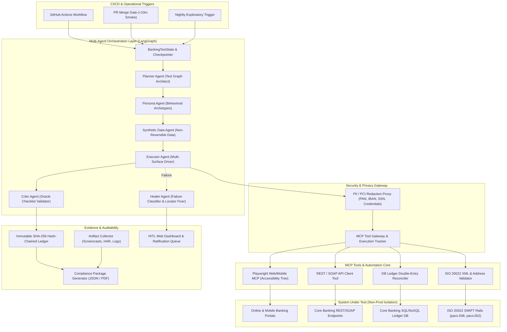
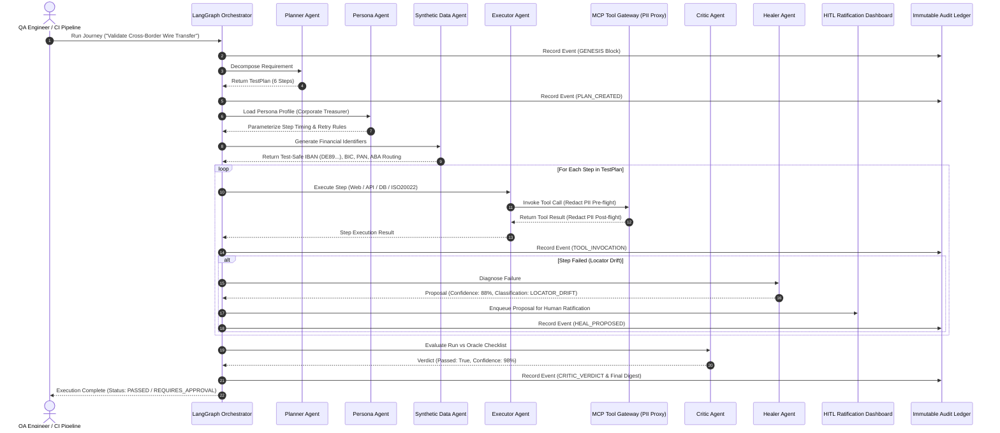
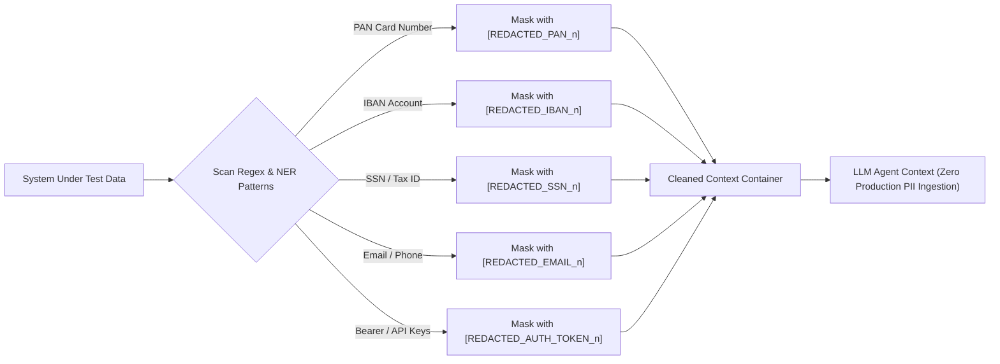

# Enterprise Banking AI Automation Testing Framework
## System Architecture, Flow Diagrams & Deployment Guide (2026 Baseline)

---

## 1. System Architecture Diagram



---

## 2. Multi-Agent Journey Execution Flow Diagram



---

## 3. PII & PCI Security Proxy Flow Diagram



---

## 4. Step-by-Step Execution Guide

### Option A: Command Line Interface (CLI)
Run the automated multi-agent suite directly using Pytest:

```bash
# 1. Activate your virtual environment and install dependencies
pip install -r requirements.txt

# 2. Run all tests with verbose output
python -m pytest tests/ -v

# 3. Run a specific test module
python -m pytest tests/test_agents_and_orchestrator.py -v
```

### Option B: Interactive Python API
You can run an end-to-end multi-agent test journey programmatically:

```python
from src.orchestrator.graph import BankingTestOrchestratorGraph
from src.evidence.ledger import ImmutableAuditLedger
from src.evidence.reporter import ComplianceReportGenerator

# Initialize Orchestrator Graph
orchestrator = BankingTestOrchestratorGraph()

# Trigger Multi-Agent Journey Execution
state = orchestrator.run_journey(
    requirement="Validate SWIFT pacs.008 wire transfer with structured address",
    journey_type="CROSS_BORDER_PAYMENT",
    persona_type="corporate_treasurer"
)

print(f"Run ID: {state.run_id}")
print(f"Execution Status: {state.status.value}")
print(f"Oracle Checklist Passed: {state.oracle_checklist_passed}")

# Export Audit Package
ledger = ImmutableAuditLedger(run_id=state.run_id)
reporter = ComplianceReportGenerator()
json_report_path = reporter.generate_json_report(state, ledger)
print(f"Audit Package Generated: {json_report_path}")
```

### Option C: Web Dashboard Portal
To launch the interactive Web Dashboard:

```bash
# Start local HTTP server
python src/dashboard/server.py
```
- Navigate to `http://localhost:8080` in your web browser.
- **Features**:
  - View real-time executive pass rate and SWIFT 2026 conformance metrics.
  - Review and ratify pending self-healing locator diffs in the **HITL Ratification Queue**.
  - Trigger new interactive multi-agent test runs across custom persona profiles.
  - Inspect the **Immutable Cryptographic Audit Ledger** SHA-256 block chain.

---

## 5. Deployment Guide

### Environment Prerequisites
- **Python**: 3.11 or higher
- **Docker**: 24.0+ & Docker Compose v2.20+
- **Playwright**: Chromium browser binaries (`python -m playwright install --with-deps chromium`)

### Local Docker Deployment
Run the complete containerized stack using Docker Compose:

```bash
# 1. Build and start services
docker-compose up --build -d

# 2. Check running container status
docker-compose ps

# 3. Stream server logs
docker-compose logs -f bankai-orchestrator
```

### CI/CD Deployment (GitHub Actions)
The repository includes an enterprise-grade GitHub Actions pipeline at `.github/workflows/ci.yml`:
- **PR Merge Gate**: Runs the deterministic smoke suite in `< 10 minutes` to block broken code merges.
- **Nightly Suite**: Triggers exploratory bug-hunting agents and full ISO 20022 conformance sweeps at 02:00 UTC.

---

## 6. Audit & Regulatory Compliance Summary

| Regulation / Standard | Framework Control Implementation |
|---|---|
| **SOX 404 & Internal Audit** | Every AI decision and tool call is recorded in an immutable append-only SHA-256 hash-chained ledger (`src/evidence/ledger.py`). |
| **PCI-DSS 4.0** | Non-reversible test BIN ranges (`400099`, `510000`, `999900`) combined with pre-flight PII proxy redaction prevent credit card data leakage. |
| **SWIFT & KPMG Nov 2026 Mandate** | Dedicated structured address conformance suite (`src/synthetic_data/address_validator.py`) enforces structured postal elements (`StrtNm`, `BldgNb`, `TwnNm`, `Ctry`). |
| **PSD2 / Strong Customer Auth (SCA)** | Persona-based simulation of 2FA tokens and session timeouts (`src/synthetic_data/persona_profiles.py`). |
